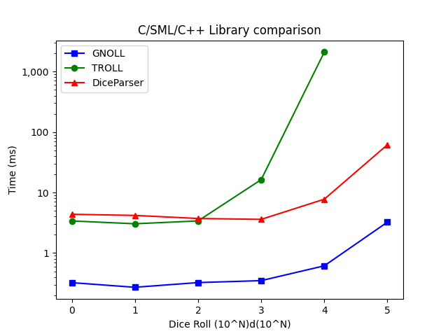
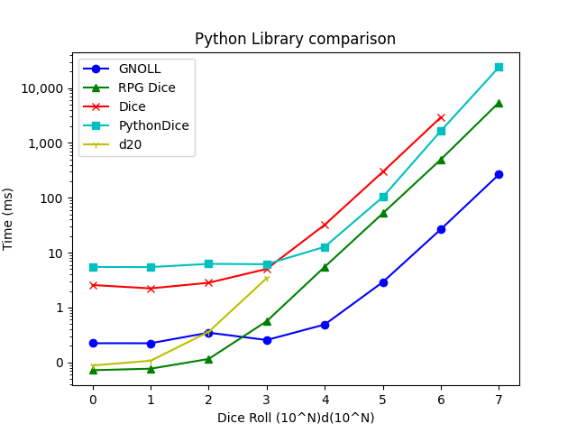

# Summary

Dice Notation is a system for describing how to roll collections of dice. It is often used to assist in understanding the rules of games - particularly tabletop roleplaying games (TTRPGs). Existing research software in this space has been primarily designed for other researchers and statisticians despite the fact that a large population of those actually playing these games are young [@DNDDemographics2019] or not involved in statistical research.

`GNOLL` is an open-source library for parsing commonly used dice notations in gaming system research and/or software development. `GNOLL` is performant, supports most popular and obscure notations, has permissive licensing, and is integratable into many other systems due to it being written in C. At present, the repository has working examples of integration into 13 different programming languages, such as Go, Java, Julia, Python, Perl and R.

# Statement of Need
While there are several dice-rolling utilities on the market for research/commercial use, there is no current solution that:

- is open source / permissively licensed.
- can be easily integrated into other software despite language differences.
- provides a reference for other implementations.
- supports such a diverse set of dice notation.

While some solutions may offer one or two of these points, GNOLL addresses all of them.

Without a more extensive project for reference/integration, many software developers have created their own dice notation parsers (for a simple subset is not too difficult to develop). These are usually sufficient for their immediate needs but often create discrepancies in notation standards and do little to change this path for future developers.

# Related Reading

Few publications specifically discuss dice notation. The most prominent papers are named `ROLL` [@ROLL] and `TROLL` [@TROLL]. GNOLL is a recursive acronym expanded from "GNOLL's Not *OLL" to distinguish this research and still pay homage to the original work. The reason for its distinction is that `GNOLL`'s notation is focused on real-world gaming usage of dice notation, whereas `ROLL` and `TROLL` are notations targeted at statistics research.

# Example Notation

There are too many different operations and combinations of dice notation to describe within the space constraints of this paper but they are discussed at length in the project's [documentation](https://ianhunter.ie/GNOLL/), including the rationale for each of the notation choices. We describe a sample of the base dice notation below.

The most basic dice roll in dice notation can be expressed as $$ x\textbf{d}y,\ where\ x,y\ \in{} \mathbb{Z}^{+}. $$ `x` dice are rolled with values from 1 to `y`. Where `x` is not specified, it is assumed that its value is 1. the exclusion of `y` produces an error (It is ambiguous to have a dice with no sides).

# Performance
`GNOLL` performs well against other dice-rolling libraries available online both in terms of performance and functional coverage. In the Figures section below, we show some simple benchmarking results against the `TROLL` system and a C++ parser and also test `GNOLL`'s Python interface against popular Python packages, and find that `GNOLL` is generally more performant. 

# Figures
## Figure 1 - GNOLL Performance (C)

Comparison of `GNOLL`'s performance against other C/C++/SmallTalk dice notation parsers - [TROLL](http://hjemmesider.diku.dk/~torbenm/Troll/) and [E Bailey's 'Dice Parser'](https://github.com/EBailey67/DiceParser).

## Figure 2 - GNOLL Performance (Python)

Comparison of `GNOLL`'s performance against other Python dice notation parsers. (Chosen from popular dice rollers on PyPi [@pep301] - ["Dice"](https://pypi.org/project/dice/), ["RPG Dice"](https://pypi.org/project/rpg-dice/), ["Python Dice"](https://pypi.org/project/python-dice/), ["d20"](https://pypi.org/project/d20/)). Unplotted points either were non-functional or exceeded a set timeout.

# Acknowledgments
Thanks to my dog for the desk-side companionship and the demand for healthy stick-fetching breaks.
Thank you also to the various TTRPG publishers and online communities for enabling people all over the world to play make-believe together.

# References
