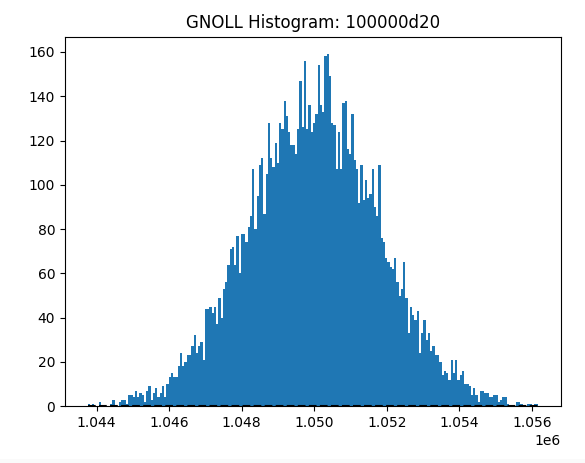
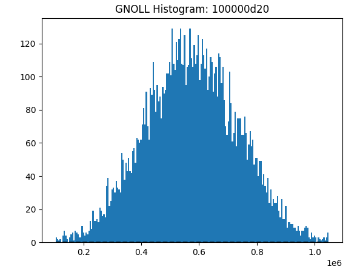
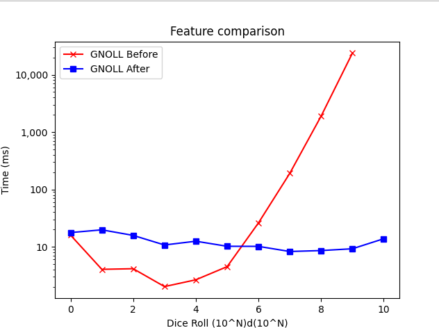

# Experimental Features

GNOLL has the following experimental features:

## Central Limit Therom + Box-Muller

Providing `USE_CLT` to make will enable an optimization for huge dice rolls.

| Regular Roll Distribution | CLT Roll Distribution |
| ------------------------- | --------------------- |
|  |  | 

We can roll on a normalized random distribution once, rather than a scaling amount of times on a uniform  random distribution. This makes GNOLL perform at a near constant time for large dice pools.

**Warning:** There are slight differences in data distribution. The CLT method tends slightly less to the center of the graph than the regular algorithm.

**Warning:** As CLT calculates the result of many dice in a single step, the information on a per-die basis is lost. Operations such as dropping/introspection are limited or nonfunctional when CLT is enabled.
